# おうちのおつかい — 機能ガイド

家族で買い物を共有するスマホアプリです。
**「あれ買ってきて」を家族みんなのリストに**まとめて、誰が何を買うかを迷わず決められます。

📱 **アプリ**: https://b-w-hiroki.github.io/otsukai/
（Safari / Chrome で開いて「ホーム画面に追加」するとアプリとして使えます）

---

## 目次

1. [まずはこれだけ — 基本の流れ](#1-まずはこれだけ--基本の流れ)
2. [⏳ そろそろ切れるかも（買い忘れ防止）](#2--そろそろ切れるかも買い忘れ防止)
3. [🛒 お買い物タブ](#3--お買い物タブ)
4. [🏪 店内モード](#4--店内モード)
5. [⚡ よく買うもの](#5--よく買うもの)
6. [🧾 購入完了済み履歴](#6--購入完了済み履歴)
7. [🎯 ミッションタブ（ごほうび・ポイント）](#7--ミッションタブごほうびポイント)
8. [📦 ストックタブ](#8--ストックタブ)
9. [⚙️ 設定タブ](#9-️-設定タブ)
10. [🔔 通知](#10--通知)
11. [👨‍👩‍👧 役割とできること](#11--役割とできること)
12. [困ったときは](#12-困ったときは)

---

## 1. まずはこれだけ — 基本の流れ

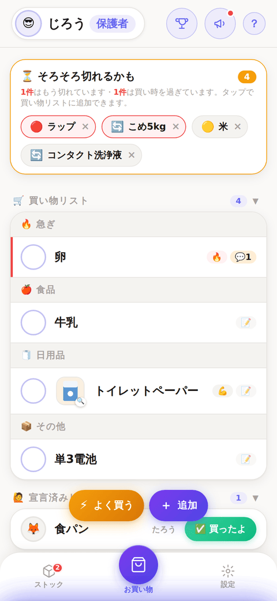

家族の誰かが**買ってほしいものを追加**し、買いに行ける人が**「買うよ」と宣言**して、買えたら**「買ったよ」**。それだけです。

```
① ＋ で追加   →   ② ◯タップで「買うよ」   →   ③「✅買ったよ」で完了
   （誰でも）          （買いに行く人）              （履歴に残る）
```

完了すると**ポイントがもらえ**、家族から**「ありがとう」**が届きます。

下のタブ（お買い物・よく買うもの・ストック・設定）は、ボタンをタップする以外に
**左右にスワイプ**しても切り替えられます。ミッションはコア機能ではないため下部タブには置かず、
右上（名前と？の間）の🏆ボタンから開きます。

---

## 2. ⏳ そろそろ切れるかも（買い忘れ防止）

**このアプリで一番おすすめの機能です。** 買い忘れそうなものを、アプリが先回りして教えてくれます。

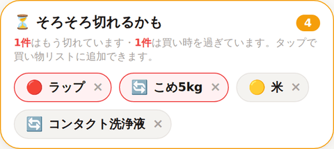

お買い物タブのいちばん上に出ます。**タップするだけで買い物リストに追加**できます（× で消せます）。

### 2つの根拠から予測します

| 表示 | 意味 | どこから来る？ |
|---|---|---|
| 🔴 **切れてる** | ストックで「切れた」と記録済み | ストックタブの記録 |
| 🟡 **残り少ない** | ストックで「少ない」と記録済み | ストックタブの記録 |
| 🔄 **約7日ごと・2日超過** | いつもの購入間隔から、そろそろ買う時期 | **買い物履歴からの自動学習** |

🔄 の予測は、**同じ品を3回以上買うと自動で働きはじめます**。
「牛乳はだいたい5日で無くなる」といった家庭ごとのペースを、アプリが履歴から学びます。設定は不要です。

> 💡 **急ぎのものは赤枠**で表示され、上に「2件はもう切れています・1件は買い時を過ぎています」と内訳が出ます。
> × を押すと消せます（そのストックが動くか、次の周期に入ると、また出てきます）。

### いつから知らせるかを変えられます

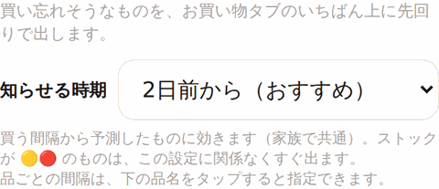

ストックタブの上部にある **⏳ そろそろ切れるかも → 知らせる時期** で、**何日前からお知らせするか**を選べます。

| 選ぶと | こうなります |
|---|---|
| 切れる当日に | ぎりぎりまで出さない。リストをすっきり保ちたい人向け |
| **2日前から（初期設定）** | 買い物のタイミングを逃しにくい、ちょうどよい設定 |
| 1週間前・2週間前・1か月前から | まとめ買いの人向け。次の買い出しでまとめて拾える |

- **家族で共通の設定**です（誰が変えても全員に反映されます）
- ストックが 🟡🔴 のものは「もう無い」という事実なので、**この設定に関係なくすぐ出ます**

### 品ごとに「◯日ごと」と決められます

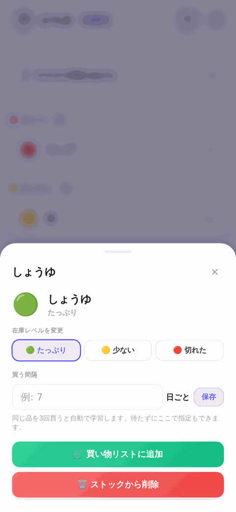

ストックタブで品名をタップ →「**買う間隔**」に日数を入れて保存すると、**履歴の学習より優先**されます。

- **3回買うのを待たずに**予測を効かせられます（登録したその日から）
- 学習した周期がしっくり来ないときの**上書き**にも使えます
- 起点は「最後に買った日」。履歴が無い品は「🟢 たっぷり」に戻した日が起点になります
- 空にして保存すると解除され、また履歴からの自動学習に戻ります

> 手で決めた間隔は「30日ごと」、学習した間隔は「約30日ごと」と表示され、見分けられます。

### 通知でも知らせます
毎週日曜20時のまとめ通知に「⏳ そろそろ切れそう: 米・ラップ」が付きます。
完了ゼロの週でも、切れそうなものがあれば単独でお知らせします。

---

## 3. 🛒 お買い物タブ

### 追加する

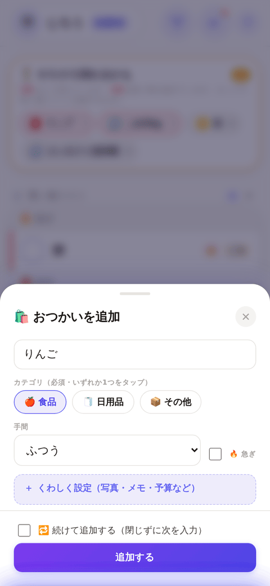

右下の **＋** から追加します。品名だけでOK、以下は任意です。

| 項目 | 使いどころ |
|---|---|
| 📷 写真 | **どれを買ってほしいか一目で伝わる**（詰め替え用・型番違い・いつものメーカーなど） |
| カテゴリ | 🍎食品 / 🧻日用品 / 📦その他 → 売り場順に並びます |
| 手間 | ふつう / 💪ちょっと大変 / 😅めちゃ大変 → **ポイントが増えます** |
| 🔥 急ぎ | リストの最上段に固定＋ポイント+1 |
| 予算上限 | 「300円以下で」など |
| ブランド指定 | 「パナソニック」など |
| メモ | 「12ロール・ダブル」など |
| 担当者を指名 | 特定の人に頼む（その人だけに通知が届きます） |

### 📷 写真は一覧からすぐ開けます

写真を付けた品は、**リスト・履歴・店内モードのどこでもサムネイルが出ます**。
右下に 🔍 が付いているので押せると分かります。**タップすると大きく表示**されます
（行そのものをタップしたときは詳細が開きます。サムネイルを押しても詳細は開きません）。

### リストの見方

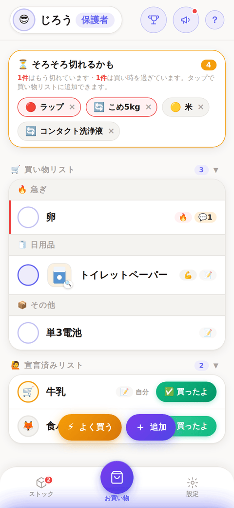

**1行1品**で、上から順に消していけます。並び順は **🔥急ぎ → 🍎食品 → 🧻日用品 → 📦その他 → 📎未分類**。売り場を回る順に消せます。

| 操作 | 動き |
|---|---|
| **◯ を1回タップ** | 「買うよ」宣言 → 宣言済みリストへ移動 |
| **◯ をもう一度タップ** | 「買うよ」を取り消し → 買い物リストに戻る |
| **✅買ったよ** | 完了 → 履歴へ移動＋ポイント獲得 |
| **行をタップ** | 詳細を開く |

◯ の中身で担当者が分かります：**空** = 誰も宣言していない、**🛒** = 自分、**🦊など** = その人が買いに行く。

> 他の人が宣言した品でも「✅買ったよ」を押せます（「たろうさんが買いに行く予定です。買ったことにしますか？」と確認が出ます）。子どもが宣言して親が持ち帰った、というときに使えます。

### 行をタップして詳細

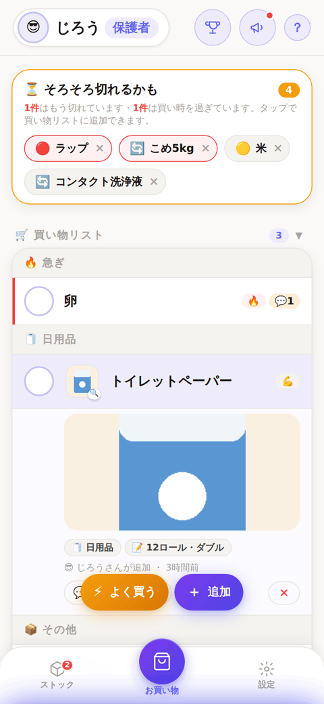

**写真**・メモ・予算・追加した人が見られ、ここから **💬コメント / ⭐よく買うものに登録 / ✏️編集 / ×削除** ができます。
写真を外すときは ✏️編集 →「✕ 写真を外す」。
よく使うボタンと削除を離すため、削除は詳細の中だけに置いています。

---

## 4. 🏪 店内モード

**スーパーで買い物している最中の専用画面**です。フロートの「🏪 店内」から開きます。

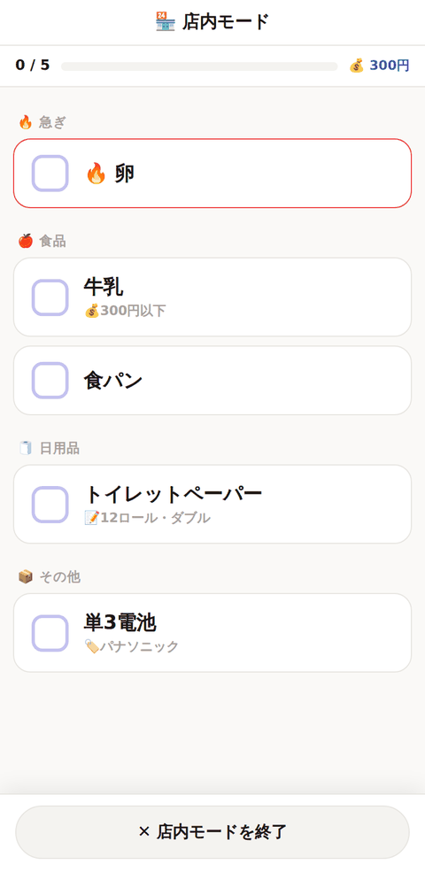 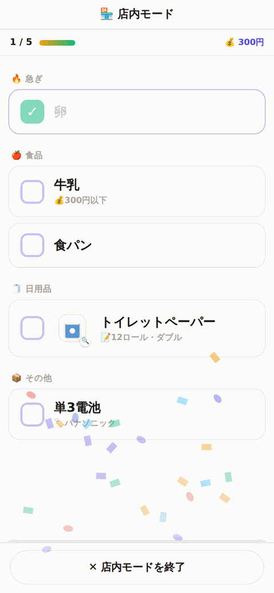

- **大きなチェックボックス** — カゴを持ったまま片手で押せます
- **1タップで完了**（通常画面の2段階を省略）
- **売り場順**に並び、上から消していけます
- 上部に **進捗（3/8）と予算合計** を常時表示
- メモ・ブランドを品名の下に表示（売り場で必要な情報だけ）
- **写真つきの品はサムネイルが出る**（タップで拡大。押しても完了にはなりません）
- 間違えたら**もう一度タップで戻せます**
- 終了ボタンは**画面下部**（親指が届く位置）

---

## 5. ⚡ よく買うもの

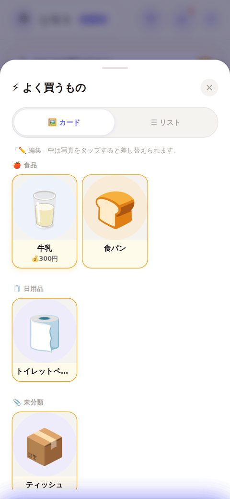

下部タブの「よく買う」から開きます。定番品を登録しておくと、**カードをタップして確認するだけで
リストに追加**できます（独立タブになって項目数が増え、隣のカードに触れてしまいやすいため、
確認をひとつ挟みます）。カテゴリごとに並びます。

**カード形式で、写真を付けられます。** 写真があると同じ商品でも型番違い・詰め替え用などを
一目で見分けられます。写真が無い項目のうち、アボカド・にんじん・鶏肉・牛乳など**よくある品名は
自動でそれっぽいイラストが出ます**（品名から連想しているだけで実際の写真ではないので、
編集モードからいつでも本物の写真に差し替えられます）。それ以外はプレースホルダーのアイコンです。

**登録の仕方は2つ**
1. 「よく買う」タブを開いた状態で **＋（画面下部中央）**から入力する（他のタブと同じ導線。写真も付けられます）
2. **買い物リストや履歴のカードにある ☆ をタップ**（メモ・予算・カテゴリごと登録されます。登録済みは⭐に変わります）

削除・写真の差し替えは「✏️ 編集」を押したときだけできます（誤操作防止）。編集モード中は
カードの写真をタップすると新しい写真に差し替えられます。

### 📦 ストックと自動で連動します

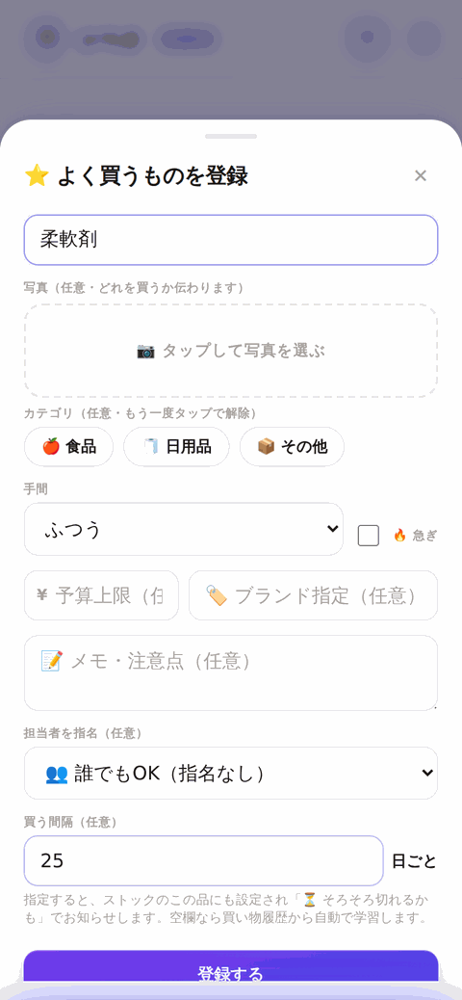

よく買うものを登録すると、**同じ名前のストック項目が無ければ自動で作られます**（🟢たっぷり）。
毎回別々に登録する手間がなくなり、[⏳ そろそろ切れるかも](#2--そろそろ切れるかも買い忘れ防止)の対象にもすぐなります。

登録シートからは、**買う間隔（任意）**も一緒に指定できます。品物によって
無くなるまでの期間はバラバラなので、ここで個別に設定しておくと、履歴が3回貯まるのを待たずに
その品専用のペースで知らせてくれます。すでに同じ名前のストックがある場合は、新規作成せず
その買う間隔だけ上書きします（在庫レベルはそのまま）。

> ☆ からの登録（上の2番目の方法）では買う間隔は指定できません。あとで
> ストックタブ → 品名をタップ → 買う間隔、から設定してください。

---

## 6. 🧾 購入完了済み履歴

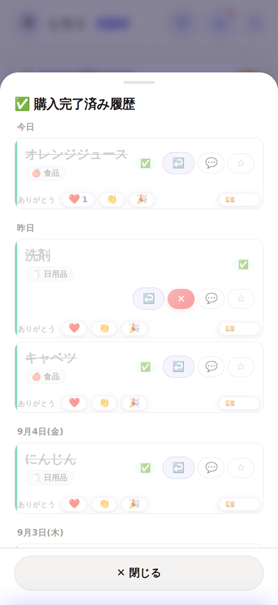

完了した買い物は一覧から消えて、ここに**日付ごと**（今日 / 昨日 / 7月28日(火)…）に貯まります。

- **❤️👏🎉 ありがとう** — 買ってくれた人にお礼を送れます（本人に通知が届きます）
- **💴 金額** — 実際に払った金額を記録できます。記録すると左上のプレイヤー情報の「今月のおかいもの」が**実支出の集計**に変わります
- **↩️** — 間違えて完了にしたものを買い物リストに戻せます
- **☆** — よく買うものに登録

完了から90日経つと自動でアーカイブへ移り、動作が重くならないようにしています。

---

## 7. 🎯 ミッションタブ（ごほうび・ポイント）

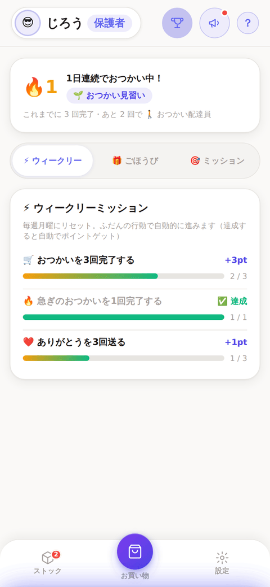

右上（名前と？の間）の🏆ボタンから開きます。

### 🔥 連続記録と称号
おつかいを完了した日が連続すると記録が伸びます。累計回数で称号が上がります。
🌱見習い → 🚶配達員 → 🛒上手 → ⭐マスター → 👑達人（画面の一番上に**常に表示**）

その下は **⚡ウィークリー / 🎁ごほうび / 🎯ミッション** の3つに切り替えられます（縦に長くなりすぎないよう分けています）。

### ⚡ ウィークリーミッション（毎週月曜リセット）
**ふだんの行動で自動的に進みます。** 特別な操作は不要です。

| ミッション | 報酬 |
|---|---|
| 🛒 おつかいを3回完了する | +3pt |
| 🔥 急ぎのおつかいを1回完了する | +2pt |
| ❤️ ありがとうを3回送る | +1pt |

### 🎁 ごほうび
おつかい完了でポイントが貯まります（**ふつう1pt / 💪2pt / 😅3pt、🔥急ぎは+1pt**）。
貯めたポイントを、保護者が登録した「ごほうび」と交換できます。

- 保護者は「✏️ ごほうびを編集」から追加・削除できます（例: アイス 3pt）
- 交換すると家族に通知が届き、交換履歴に残ります
- ポイントが足りないごほうびは、ボタンが薄く表示されます

### 家族からのミッション
保護者が子どもに「〇〇を3回やったら300円」のようなミッションを出せます（ウィークリーとは別枠）。

---

## 8. 📦 ストックタブ

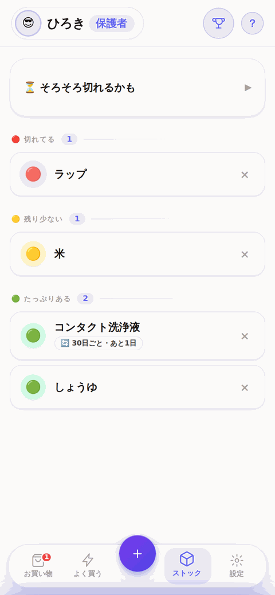

家にある物の残量を記録しておく場所です。**丸をタップするたびに 🟢 → 🟡 → 🔴 → 🟢 と切り替わります。**

タブ上部の **⏳ そろそろ切れるかも** はアコーディオンになっていて、開くと
「何日前からお知らせするか」（知らせる時期）を選べます（→ [2章](#2--そろそろ切れるかも買い忘れ防止)）。

- 🟢 たっぷりある / 🟡 残り少ない / 🔴 切れてる
- 写真を付けて登録できます（どれのことか一目で分かる）
- 🟡🔴 にすると、**お買い物タブの「⏳ そろそろ切れるかも」に自動で出ます**
- 買い物履歴から周期が読める品には「🔄 約7日ごと・あと2日」と予測も表示されます
- タップして詳細から「🛒 買い物リストに追加」、**「買う間隔」の指定**ができます（→ [2章](#2--そろそろ切れるかも買い忘れ防止)）
- 登録時に「何日ごとに買う？」を入れておくこともできます
- **[⚡よく買うもの](#5--よく買うもの)に登録すると、ここにも自動で追加されます**（同じ名前が無い場合のみ）

---

## 9. ⚙️ 設定タブ

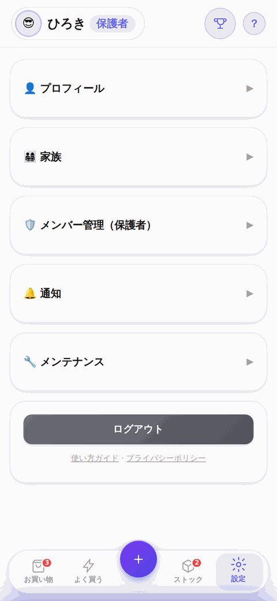

| 項目 | 内容 |
|---|---|
| 👤 プロフィール | 名前・絵文字アイコン |
| 👨‍👩‍👧‍👦 家族 | 招待コード（これを家族に共有して参加してもらう）・メンバー一覧 |
| 🛡️ メンバー管理 | **保護者のみ** |
| 🔔 通知 | サウンド / テーマ（端末に合わせる・ライト・ダーク）/ 買い物リマインドの時刻 |
| 🔧 メンテナンス | 更新・復旧用 |

**⏳ そろそろ切れるかも**（知らせる時期）は設定タブではなく、**ストックタブ**の上部にあります。

各項目はタップで開閉するアコーディオンになっています。既定はすべて閉じていて、
開いた・閉じたの状態は端末ごとに覚えます（スクロールを短くするため）。

**📊 今月のおかいものは設定タブではなく、左上のプレイヤー情報（アバターをタップ）にあります。**
完了件数と支出（💴を記録していれば実支出、無ければ予算合計）に加えて、
「＋ その他の支出を記録」もここから行えます。

### 💴 その他の支出を記録

お使いリストを通さずに買ったもの（コンビニでの立て替えなど）も、金額だけ記録して
「今月のおかいもの」の集計に含められます。**左上のプレイヤー情報**（アバターをタップ）の
「📊 今月のおかいもの」にある**「＋ その他の支出を記録」**から。

- レシート写真を選ぶと、端末内で無料のOCR（文字認識）が金額を読み取り、
  金額欄に仮入力します。読み取り精度は完璧ではないため、**保存前に必ず金額を確認**してください
  （レシート写真自体は保存されません。金額を読み取るためだけに使います）
- OCRを使わず、金額を直接入力するだけでもOK
- 記録した分はカード内に一覧表示され、間違えたら×で削除できます

### 🛡️ メンバー管理（保護者のみ）

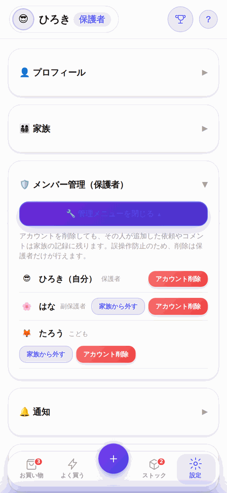

誤操作を防ぐため、**「管理メニューを開く」を押したときだけ**操作できます。

- **家族から外す** — その人はデータを見られなくなります（アカウントは残ります）
- **アカウント削除** — プロフィール・統計・ログイン情報を削除。**追加した依頼やコメントは家族の記録として残ります**
- 最後の保護者は削除できません（誰も管理できない状態を防ぐため）

### 🔧 メンテナンス

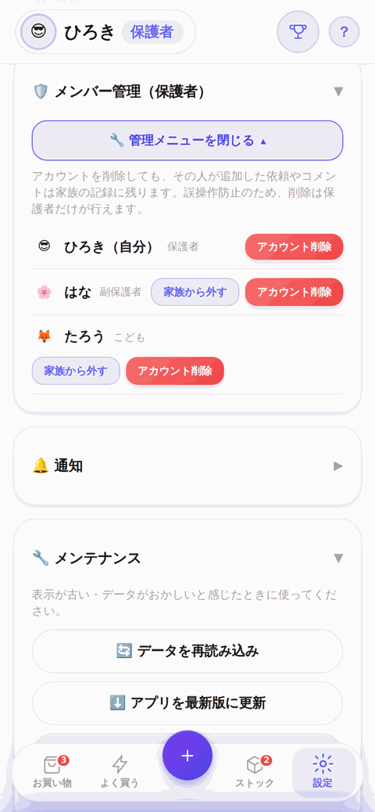

| ボタン | 使いどころ |
|---|---|
| 🔄 データを再読み込み | 表示が最新でない気がするとき |
| ⬇️ アプリを最新版に更新 | 新機能が出ているのに反映されないとき（キャッシュを破棄して取り直します） |
| 🚪 強制ログアウト | データがおかしいとき（家族のデータは消えません） |

また、**ホーム画面を下に引っ張っても更新**できます。
新しいバージョンが出ると画面上部に「🆕 新しいバージョンがあります」と出るので、タップするだけで更新できます。

### 🎨 ダークモード

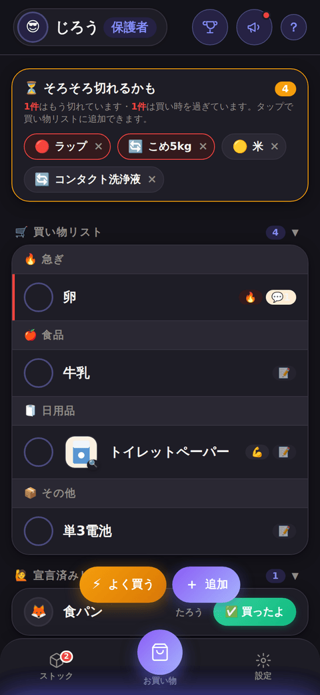

初期設定は「端末の設定に合わせる」です。スマホがダークモードならアプリも暗くなります。
設定 → 🎨テーマ から「ライト」「ダーク」に固定もできます（端末ごとに保存されます）。

---

## 10. 🔔 通知

スマホを閉じていても届きます（設定 → 通知 →「通知をオンにする」で有効化）。

> ここは**利用者から見た通知の一覧**です。どの関数がどれを送っているかは
> [`functions/README.md`](../functions/README.md#含まれる関数9つ) が正本。通知を足すときは両方直す。

| いつ | 内容 | 誰に |
|---|---|---|
| 新しい依頼が追加されたとき | 「○○さんが『牛乳』を頼んでいます」（急ぎは🔥） | 依頼者以外の家族 |
| 指名されたとき | 「○○さんから『牛乳』を頼まれました」 | 指名された人だけ |
| 誰かが立候補したとき | 「○○さんが買いに行きます」 | 依頼した人 |
| 買ってきたとき | 「○○さんが買ってきました」 | 依頼した人 |
| ありがとうが届いたとき | 「○○さんからありがとう！」 | 買った人 |
| ごほうび交換したとき | 「○○さんがアイスと交換しました」 | 本人以外の家族 |
| ウィークリーミッション達成 | 「クリア！ +3pt ゲット」 | 本人 |
| **設定した時刻**（毎日） | 「未受け取りの買い物が3件あります」 | 家族全員 |
| **毎週日曜20時** | 週のまとめ＋MVP＋**⏳そろそろ切れそう** | 家族全員 |

- 通知の時刻は設定タブから追加・削除できます（家族で共有・5分きざみ）
- 通知が要らない人は「通知をオフにする」で**その端末だけ**止められます

---

## 11. 👨‍👩‍👧 役割とできること

| | 保護者 | 副保護者 | こども |
|---|:---:|:---:|:---:|
| 買い物の追加・宣言・完了 | ✅ | ✅ | ✅ |
| コメント・ありがとう | ✅ | ✅ | ✅ |
| ストックの記録 | ✅ | ✅ | ✅ |
| ポイントでごほうび交換 | ✅ | ✅ | ✅ |
| ごほうびの登録・削除 | ✅ | — | — |
| ミッションを出す | ✅ | ✅ | — |
| 役割の変更・メンバー管理 | ✅ | — | — |

家族に入るには**招待コード**（設定タブに表示）を共有します。参加した人は最初「こども」になり、保護者が役割を変更できます。

---

## 12. 困ったときは

| 症状 | 対処 |
|---|---|
| 新機能が出ていない | 設定 → 🔧メンテナンス → **⬇️ アプリを最新版に更新** |
| 表示が最新でない気がする | ホーム画面を**下に引っ張る**、または 🔄 データを再読み込み |
| 通知が来ない | 設定 → 通知 →「通知をオンにする」／端末の通知設定を確認。iPhoneは**ホーム画面に追加したアプリから**開く必要があります |
| データがおかしい | 設定 → 🔧メンテナンス → 🚪 強制ログアウト（家族のデータは消えません） |
| 家族に入れない | 招待コードは6文字（英大文字と数字）。保護者に再確認を |
| 写真だけ保存されない | 内容は保存されています。通信環境を確認して、✏️編集から選び直してください |
| ⏳ の予告が早すぎる・遅すぎる | ストック → ⏳そろそろ切れるかも → **知らせる時期**を変更 |
| ⏳ に出てくる周期がずれている | ストックタブで品名をタップ → **買う間隔**を手で指定（履歴の学習より優先されます） |
| 買ったばかりの品が ⏳ に出る | その品のストックを **🟢 たっぷり**に戻すと、そこが周期の起点になります |

---

## 補足: このアプリについて

- **オフラインでも起動**できます（買い物中に圏外でもリストが見られます。変更はオンライン復帰後に同期）
- データは家族グループの中だけで共有され、**外部には公開されません**（[プライバシーポリシー](https://b-w-hiroki.github.io/otsukai/privacy.html)）
- 完了した買い物は90日でアーカイブへ自動整理されます

*このガイドのスクリーンショットは、テスト用のサンプルデータで撮影しています。*
